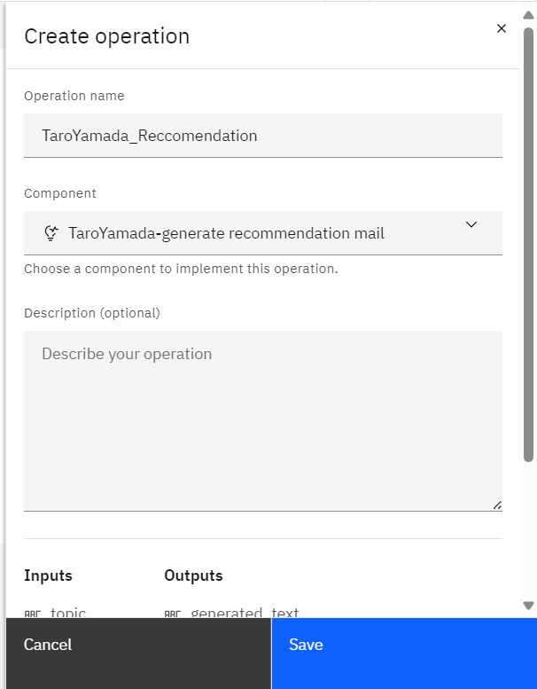

# Automation builder (生成AI)
watsonx Orchestrate では、Lab2 で行ったように生成AIをカスタムスキルとして外部から呼び出すことが可能ですが、Automation Builder では生成AIのプロンプトを作成し、スキルとして公開できます。
このLabでは、顧客の特性に応じてメールを生成するプロンプトを作成します。

## 前提条件
 1. watsonx Orchestrateの環境にアクセスできること。
 2. IBM-idを用いてログイン可能であること。

## Automation (生成AI) を作成してみよう
Automation builder では、Lab3 と同様に Automation のアプリケーションを作成し、生成AI のプロンプトを作成できます。

 1. メニュー(≣)から **Automations** を選択します。  
    

 2. **Create automation +** をクリックし、新規の Automation を作成します。
 

 3. Create automation のウィンドウで、名前の欄に **YourName_recommendation** と入力し、**Create** をクリックします。  
 

 4. 生成AIを選択します。
 

 名前を **YourName-generate recommendation mail** と入力して、**Create** をクリックします。
 

こちらで、Automation と 生成AIのコンポーネント が作成されました。作成されると、プロンプト・エディターが開きます。

## プロンプトを作成してみよう
プロンプト・エディターを用いて、プロンプトを作成し、出力を生成することができます。

 1.**Prompt** にある **Model:** のプルダウンメニューから、使いたいモデルを選択します。今回は、**mixtral-8x7b-instruct-v01** を選択します。
 .png>)

 2. プロンプトを作成します。
    1. **Context** にモデルへの命令文を入力します。今回は、顧客の特性に応じておすすめの観光地を紹介するメールを生成します。以下の文章を参考に入力します。 (一分ごとに改行してください) 
    ***あなたは、優秀な観光業のマーケターです。***  
    ***観光地のPRをするため、お客様に興味を持ってもらえるメールを送ろうとしています。***  
    ***お客様の特性に合わせて、おすすめの観光地を紹介するメールを日本語で作成してください。***
    

    2.  **Pronpt input** にモデルに応答してほしい文章を入力します。以下の文章を参考に入力します。  
    ***お客様は、20代で、写真撮影が好きです。***
    

    3.  変数を追加します。
     変数は、生成AIの入力として使用されます。変数を使用しない場合も、少なくとも1つの変数を定義する必要があります。
        1. **Variable** の欄で **New variable** をクリックします。
        

        2. 変数に名前を付け、デフォルト値を入力します。 変数の名前と値は String (文字列) でなければなりません。今回は、以下の３つを作成します。（topic は既存の変数のデフォルト値のみ変更してください）

            |Variable|Default value|(意味)|(挿入先)|
            |:---:|:---:|--------|---|
            |topic|観光地|おすすめしたいトピック|context|
            |age|20|お客様の年代|prompt input|
            |hobby|写真撮影|お客様の趣味|prompt input|

         

        3. 上の表に従って、**Prompt Input** または **Context** の欄で、プロンプトに変数を挿入します。（文字や数値で書いている部分を変数に置き換えます）
            1. 変数名は、二重の中かっこ {} で囲む必要があります。 (例: {{topic}})
            2. 以下の方法で、変数を自動的に挿入できます。
                - **+** アイコン（Add variable）をクリックし、リストから変数を選択します。
                - 欄内で **Ctrl + スペース** をクリックし、変数を選択します。
            3. 完了すると、以下のような文章になります。
             
            4. 右上の **×** をクリックしてオプションを閉じ、**Generate** をクリックします。すると、文章が生成されますが、以下のように途中で切れてしまっているかと思います。これは、トークンが小さいためです。
            

            
    4. **Parameters** の欄でトークンを設定し、生成される出力の長さを制限します。  
     トークンは、モデルに対して意味を持つ文字の集合です。プロンプトのテキストは、LLMによって処理される前にトークンに変換されます。
        - デフォルトでは、最小値と最大値はそれぞれ 1 と 50 に設定されています。
        - 最小値を 0 にすることはできません。
        - 最大値の制限は、選択したモデルによって異なります。

        右上の歯車(⚙)のマークをクリックし、再びオプションを表示します。
        
        今回は、トークンの最大値 **Max generated tokens** を 500 に設定します。
        

 3. 右上の **×** をクリックしてオプションを閉じ、**Generate** をクリックします。
 4. **Generated output** の欄で結果を確認します。
 **Raw prompt** のアイコン () をクリックして、未加工のプロンプトを確認することもできます。
 
 **View raw prompt** が開き、生成された出力を取得するために使用された context や prompt input、training examples を確認できます。
 
 5. 必要に応じて、より良い結果を得るためにプロンプトを調整します。

## (オプション)トレーニング例 (Training examples) の追加
 プロンプトが生成する出力の精度や品質、安定性を高めるため、プロンプトに例を追加することができます。

 入力と対応する出力のペアを1つ以上指定します。

 1. ページ下部にある **Training example** の欄で、**New example** をクリックします。
 
 2. 入力と期待される出力を記入します。以下はトレーニングサンプルの例です。
  
input:
>お客様は30代で、食べ歩きが好きです。

Expected output:  

>こんにちは。
今回は、食べ歩きがお好きなあなたへ、国内で食べ歩きできるおすすめの観光地を3つご紹介します！

>1. 小樽  
>小樽は、レンガ造りの倉庫が並ぶノスタルジックな街です。  
>北海道の新鮮な海鮮類や、生乳を使ったスイーツを楽しめます！

>2. 川越  
>川越は、江戸時代の街並みが広がり、着物を着て風情を楽しむこともできます。  
>名産品であるサツマイモを使ったスイーツが豊富で、食べ歩きしやすい街です！  

>3. 伊勢  
>伊勢神宮へ参拝する道にある「おかげ横丁」は、日本最大の食べ歩きスポットと言われています。  
>伊勢名物「赤福」や、松阪牛、伊勢うどんなど、名産品にあふれた食べ歩きスポットです！  

>弊社では、ご紹介した観光地をはじめとして、食べ歩きにおすすめの観光地を巡るツアーを多数ご用意しております！  
>弊社サイトでも、様々な観光地の魅力や訪問者の声などを掲載しておりますので、ぜひご参考になさってください。  
>この機会にぜひ、旅行を検討されてみてはいかがでしょうか？

 3.** Generate** をクリックしてプロンプトをテストします。生成された出力の精度が向上しているか確認してください。

 **ヒント:** 一般に、指定する入出力のペアが多いほど、結果は良くなります。ただし、例が多すぎる場合は、モデルで許可されている入力の最大トークンと入出力全体の最大トークンのスペースが減る可能性があります。

## 生成AIを公開してみよう
生成AIのコンポーネントの作成が完了したら、operation を作成してこのコンポーネントを他のユーザーに公開します。それにより、彼らのAutomationの中で使ってもらったり、トレーニングしてもらったりすることが可能です。  
 1. **Operation** タブを開きます。
   
 2. **Create operation** をクリックします。
   
 3. **Operation name** の欄に、**YourName_Reccomendation** (ハイフンやスペースは使えません) と入力し、**Component** の欄で公開したいコンポーネントを選択します。  
 
 4. **Save** をクリックします。  
 これで operation が作成されました。次に、このコンポーネントをスキルとして公開します。
 5. **Share changes** をクリックします。
 
 6. **Share** をクリックします。
 
 ポップアップが出てきたら再度 **Share** をクリックします。
 
 7. シェアが完了したら、元のプロンプト・エディターの画面に戻ります。
 8. 次に **History** のタブをクリックします。
 
 9. 一番上の行の **Version +** をクリックします。
 
 10. ポップアップが出てきたら、バージョンの名前の欄に **1.0.0** と入力して、**Create** をクリックします。
 
 11. 1.0.0 というバージョンが作成されたので、これをスキルとして公開します。**Publish** というタグをクリックします。
 
 12. 1.0.0 のバージョンをクリックすると、下に詳細が表示されます。**Publish** をクリックします。
 
 確認画面が出てくるので、もう一度 **Publish** をクリックします。
 
 13. 正常に公開されると、以下のように **Published** と表示されます。
 
 14. 左上のメニューから **Skills and apps** に戻ってみます。**Skills** のタブを選択すると、公開した生成AIのスキルが **Ready to Publish** の状態で表示されます。これまでのLabで行ったように、**Enhance this skill**をクリックして Enhance すると、スキルを利用できるようになります。
 

## お疲れさまでした！
このLabでは、Automation builder を用いて生成AIのプロンプトを作成しました。
Context や prompt input を記入したり、変数を設定したりして、出力を生成しました。
また、トークンや training example の調整を行うことで、出力の精度を向上させることができました。

     シナリオ考える（メールなど）
     日本語で動かして（llama-2）にして

 