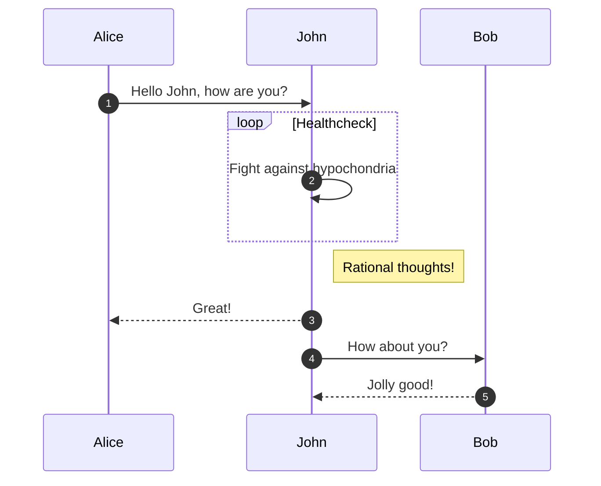

# はじめに

For full documentation visit [mkdocs.org](https://www.mkdocs.org).

## Commands

## Commands

## aaaaa

### BBBBB

* `mkdocs new [dir-name]` - Create a new project.
* `mkdocs serve` - Start the live-reloading docs server.
* `mkdocs build` - Build the documentation site.
* `mkdocs -h` - Print help message and exit.


## test [text](images-2)

## Project layout

    mkdocs.yml    # The configuration file.
    docs/
        index.md  # The documentation homepage.
        ...       # Other markdown pages, images and other files.

](index_images/image-2.png)](index_images/image-1.png)](index_images/image.png)


[こちら](./files/test.txt)


ボールド**こちら**テスト





|method|description|
|-------|----|
|test|bbb|

```html
this is a pen
```